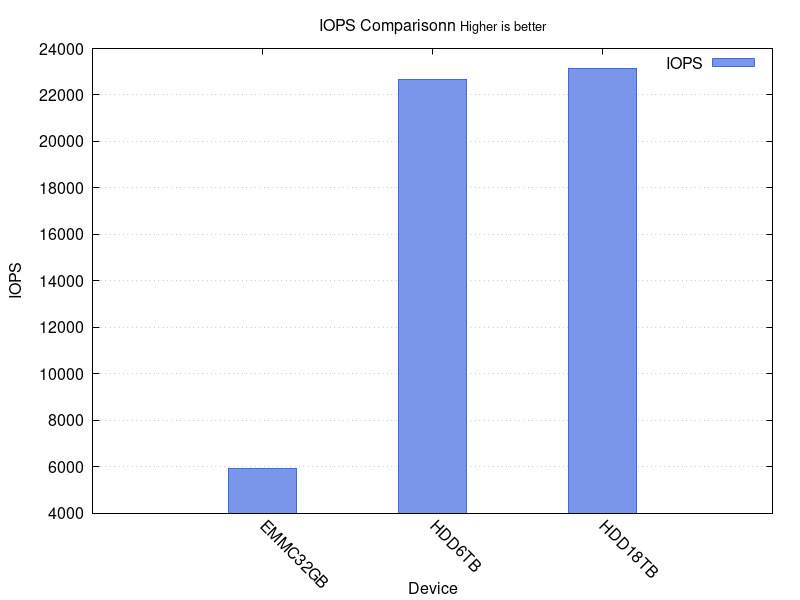
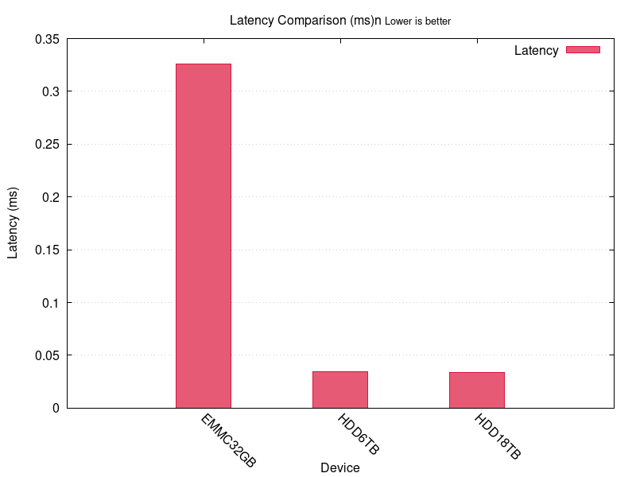

# Linux Storage Benchmark Tool

A thorough performance evaluation toolkit for comparing storage devices in Linux systems. This script allows you to test and compare multiple storage devices by measuring their sequential and random read/write performance, IOPS, and latency.


## Table of Contents

- [Features](#features)
- [Requirements](#requirements)
- [Installation](#installation)
- [Usage](#usage)
  - [Parameters](#parameters)
  - [Examples](#examples)
- [Benchmark Tests](#benchmark-tests)
- [Output Examples](#output-examples)
  - [Bandwidth Comparison](#bandwidth-comparison)
  - [IOPS Comparison](#iops-comparison)
  - [Latency Comparison](#latency-comparison)
- [Generated Files](#generated-files)
- [Configuration](#configuration)
- [ZFS Considerations](#zfs-considerations)
- [Sample Output Directory Structure](#sample-output-directory-structure)
- [Interpreting Results](#interpreting-results)
- [License](#license)
- [Author](#author)

## Features

- Benchmark multiple storage devices in a single run
- Measure sequential read/write performance with configurable block sizes
- Test random read/write operations
- Measure IOPS (Input/Output Operations Per Second)
- Calculate access latency
- Generate comparative graphs between devices
- Create detailed reports in text and CSV formats
- Configurable test parameters via global variables
- Configurable direct I/O setting

## Requirements

- Linux operating system
- Root privileges (for accurate cache clearing)
- FIO: Flexible I/O Tester (`sudo apt install fio`)
- JQ: JSON processor (`sudo apt install jq`)
- GnuPlot: Graph plotting (optional, `sudo apt install gnuplot`)

## Installation

1. Clone the repository or download the script:
   ```bash
   git clone https://github.com/username/storage-benchmark.git
   cd storage-benchmark
   ```

2. Make the script executable:
   ```bash
   chmod +x storage_benchmark.sh
   ```

## Usage

```bash
sudo ./storage_benchmark.sh DEVICE_NAME MOUNT_PATH [DEVICE_NAME2 MOUNT_PATH2 ...]
```

### Parameters

- `DEVICE_NAME`: Logical name or identifier for the device. This name will be used in all graphs, reports, and output files. Choose a name that helps you identify the device (e.g., EMMC_32GB, SSD_1TB, HDD6TB).
- `MOUNT_PATH`: Path to the mount point of the device to test. This is where the benchmark files will be written.

**Important**: The `DEVICE_NAME` is not directly related to the actual device name in your system. It's a label you choose to identify the device in reports and graphs.

### Examples

The graphs in this README were generated using the following command:

```bash
sudo ./storage_benchmark.sh EMMC_32GB /home/cmiranda/benchmark/ HDD6TB /archive/benchmark/
```

Where:
- `EMMC_32GB` is the label for a device mounted at `/home/cmiranda/benchmark/` 
- `HDD6TB` is the label for a ZFS dataset mounted at `/archive/benchmark/` (from the ZFS pool `V8HPP56R/archive`)

You can run similar comparisons with:

```bash
# Benchmark a single eMMC device
sudo ./storage_benchmark.sh EMMC_32GB /path/to/emmc_mount

# Compare an SSD with an HDD
sudo ./storage_benchmark.sh SSD_NVME /mnt/nvme HDD_SATA /mnt/hdd

# Compare three different storage devices
sudo ./storage_benchmark.sh EMMC_32GB /mnt/emmc SSD_NVME /mnt/nvme HDD6TB /data
```

## Benchmark Tests

The script runs the following tests:

- **Sequential Read**: Measures continuous read performance with large blocks
- **Sequential Write**: Measures continuous write performance with large blocks
- **Random Read**: Measures non-sequential small block read performance
- **Random Write**: Measures non-sequential small block write performance
- **IOPS Test**: Measures maximum input/output operations per second
- **Latency Test**: Measures time delay between request and response

## Output Examples

### Bandwidth Comparison

This graph shows the read/write speeds in MB/s for different test types across devices.

<p>
  
</p>

### IOPS Comparison

This graph compares the Input/Output Operations Per Second between devices.



### Latency Comparison

This graph shows the access latency in milliseconds for each device.



## Generated Files

The script creates a timestamped directory (`benchmark_results_YYYYMMDD_HHMMSS`) containing:

| File Type | Description |
|-----------|-------------|
| `*_comparison.png` | Graph visualizations of benchmark results |
| `*_results.csv` | Raw data results in CSV format |
| `*_test.json` | Detailed FIO test results in JSON format |
| `benchmark_report.txt` | Comprehensive text report with test parameters and results |
| `*_plot.gnuplot` | GnuPlot scripts used to generate graphs |

## Configuration

You can customize the benchmark parameters by modifying the global variables at the beginning of the script:

```bash
# Test sizes
SEQ_TEST_SIZE="1g"       # Size for sequential tests
RAND_TEST_SIZE="1g"      # Size for random tests
LATENCY_TEST_SIZE="256m" # Size for latency test

# Block sizes
SEQ_BLOCK_SIZE="1m"      # Block size for sequential tests
RAND_BLOCK_SIZE="4k"     # Block size for random tests 

# I/O configuration
SEQ_IODEPTH="4"          # I/O depth for sequential tests
RAND_IODEPTH="32"        # I/O depth for random tests
IOPS_IODEPTH="64"        # I/O depth for IOPS test
LATENCY_IODEPTH="1"      # I/O depth for latency test
USE_DIRECT_IO="1"        # Use direct I/O (1=yes, 0=no)

# Job counts
SEQ_JOBS="1"             # Jobs for sequential tests
RAND_JOBS="4"            # Jobs for random tests
IOPS_JOBS="4"            # Jobs for IOPS test
LATENCY_JOBS="1"         # Jobs for latency test

# Runtime parameters
TEST_RUNTIME="10"        # Runtime in seconds for each test
```

## ZFS Considerations

For ZFS filesystems, the ARC cache can significantly impact benchmark results. For more realistic hardware testing, consider:

- Temporarily setting primarycache=metadata: `sudo zfs set primarycache=metadata pool/dataset`
- Using larger test sizes (4GB+) to exceed cache size
- Running longer tests (30+ seconds) to measure sustained performance
- Restore original settings after testing: `sudo zfs set primarycache=all pool/dataset`

## Sample Output Directory Structure

```
benchmark_results_20250426_153927/
├── bandwidth_comparison.png    # Graph of bandwidth performance
├── bandwidth_plot_data.txt     # Processed data for bandwidth plot
├── bandwidth_plot.gnuplot      # Gnuplot script for bandwidth graph
├── bandwidth_results.csv       # Raw bandwidth results
├── benchmark_report.txt        # Comprehensive report of all results
├── EMMC_32GB_iops_test.json    # IOPS test details for EMMC_32GB
├── EMMC_32GB_latency_test.json # Latency test details for EMMC_32GB
├── EMMC_32GB_rand_read.json    # Random read test details for EMMC_32GB
├── EMMC_32GB_rand_write.json   # Random write test details for EMMC_32GB
├── EMMC_32GB_seq_read.json     # Sequential read test details for EMMC_32GB
├── EMMC_32GB_seq_write.json    # Sequential write test details for EMMC_32GB
├── gnuplot_error.log           # Error log for gnuplot (if any)
├── HDD6TB_iops_test.json       # IOPS test details for HDD6TB
├── HDD6TB_latency_test.json    # Latency test details for HDD6TB
├── HDD6TB_rand_read.json       # Random read test details for HDD6TB
├── HDD6TB_rand_write.json      # Random write test details for HDD6TB
├── HDD6TB_seq_read.json        # Sequential read test details for HDD6TB
├── HDD6TB_seq_write.json       # Sequential write test details for HDD6TB
├── iops_comparison.png         # Graph of IOPS performance
├── iops_plot.gnuplot           # Gnuplot script for IOPS graph
├── iops_results.csv            # Raw IOPS results
├── latency_comparison.png      # Graph of latency performance
├── latency_plot.gnuplot        # Gnuplot script for latency graph
└── latency_results.csv         # Raw latency results
```

## Interpreting Results

- **Bandwidth (MB/s)**:
  - Higher is better
  - Sequential read/write shows maximum throughput capacity
  - Typical values range from ~20 MB/s (slow HDDs) to 3000+ MB/s (NVMe SSDs)

- **IOPS (I/O Operations Per Second)**:
  - Higher is better
  - Measures how many small operations a device can handle per second
  - Critical for database and virtualization workloads
  - Typical values range from hundreds (HDDs) to hundreds of thousands (Enterprise SSDs)

- **Latency (ms)**:
  - Lower is better
  - Measures the time delay for operations to complete
  - Critical for interactive and real-time applications
  - Typical values range from <0.1ms (SSDs) to 5-10ms (HDDs)

## License

Copyright (c) 2025. All rights reserved.

## Author

- Mstaaravin
- Contributors: Developed with assistance from Claude AI
